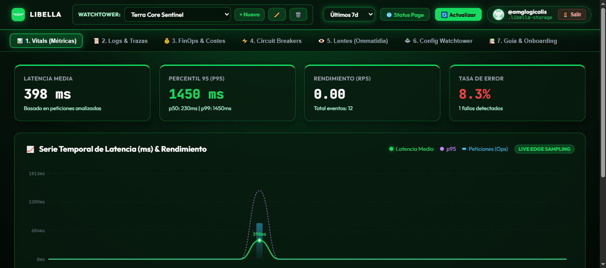

<p align="center">
  <a href="https://amglogicalis.github.io/libella-repo-public/" target="_blank">
    
  </a>
</p>

<h1 align="center">LIBELLA — The Universal Panopticon</h1>

<p align="center">
  <strong>$0 Real-Time Telemetry, Edge Time-Series & Multi-Cloud FinOps Engine</strong><br>
  <em>Observabilidad Universal, Lentes Polimórficas (Ommatidia), Tetrapteryx, AI Gateway & Circuit Breakers Autónomos</em>
</p>

<p align="center">
  <a href="https://amglogicalis.github.io/libella-repo-public/"></a>
  <a href="https://amglogicalis.github.io/libella-repo-public/status.html"></a>
  <a href="https://www.npmjs.com/package/terra-libella"></a>
  
  
  
</p>

---

## 📸 Vista Previa de la Consola Web

<p align="center">
  <a href="https://amglogicalis.github.io/libella-repo-public/" target="_blank">
    
  </a>
</p>

<p align="center">
  👉 <a href="https://amglogicalis.github.io/libella-repo-public/"><strong>Abrir Consola Web Online en Vivo</strong></a> · 
  📊 <a href="https://amglogicalis.github.io/libella-repo-public/status.html"><strong>Ver Status Page Pública (30 Días de Uptime)</strong></a>
</p>

---

## 🚀 Acceso Directo y Recursos

| Recurso | Enlace Directo | Descripción |
| :--- | :--- | :--- |
| 🛸 **Consola Web Online** | [**amglogicalis.github.io/libella-repo-public**](https://amglogicalis.github.io/libella-repo-public/) | Dashboard interactivo en GitHub Pages para monitorizar métricas, logs, FinOps y breakers. |
| 📊 **Status Page Pública** | [**amglogicalis.github.io/.../status.html**](https://amglogicalis.github.io/libella-repo-public/status.html) | Semáforo de salud global, barra interactiva de 30 días bloque a bloque y ciclo de incidentes. |
| 📦 **Paquete Oficial NPM** | [`terra-libella` en npm](https://www.npmjs.com/package/terra-libella) | CLI autónoma y SDK TypeScript isomórfico con cero dependencias en runtime. |

---

## 👁️ ¿Qué es Libella y Cómo Funciona?

En la industria actual, la monitorización representa un impuesto masivo: plataformas como Datadog, New Relic o Grafana Cloud cobran elevadas tarifas por ingerir eventos, guardar logs y pintar gráficas.

**Libella** es el **Panóptico Universal** del [Ecosistema Terra](https://github.com/amglogicalis/Terra): un motor de observabilidad perimetral a **coste $0 perpetuo**:
- **Almacenamiento Git Inmutable**: La telemetría en caliente de las últimas 24h reside en tu propio repositorio privado de GitHub (`.libella-storage`).
- **El Cronógrafo (Compresión Columnar)**: Compacta automáticamente miles de registros diarios en rollups estadísticos ligeros (preservando p50, p95, p99 y costes), permitiendo almacenar años de historia en pocos megabytes.
- **Sin Servidores Permanentes ni Bases de Datos de Pago**: Sin PostgreSQL, sin ClickHouse, sin clusters de Kubernetes.
- **Aislamiento Multi-Tenant (Las Libellas / Watchtowers)**: Cada aplicación o entorno tiene su propio centinela con presupuestos independientes y su propia Status Page.

---

## 💻 Instalación y Primeros Pasos

### 1. Instalación Global de la CLI
```bash
npm install -g terra-libella
```

*(O ejecútalo directamente sin instalar nada con `npx`):*
```bash
npx terra-libella console
```

### 2. Instalación en tu Proyecto (SDK)
```bash
npm install terra-libella
```

### 3. Autenticación (en orden de precedencia)
Libella se conecta directamente a tu repositorio de almacenamiento `.libella-storage`:
1. Flag en línea de comandos: `--pat <tu_token_de_github>`
2. Variable de entorno: `LIBELLA_GITHUB_TOKEN=ghp_...`
3. Variable estándar: `GITHUB_TOKEN=ghp_...`
4. GitHub CLI (`gh auth token`, detectado automáticamente)
5. **Modo 100% Offline / Local**: Si corres `libella console` en local sin token, opera con almacenamiento local inmediato.

---

## 🧭 Para Qué Sirve Cada Función y Cómo Usarla

### 1. 🖥️ Consola Web (Local & Online)
Inicia la consola web con interfaz dark glassmorphism y métricas en tiempo real:

```bash
# Iniciar en puerto por defecto (3377)
libella console

# Puerto personalizable (argumento posicional directo)
libella console 4500

# Con flag corto o largo y apertura automática en el navegador
libella console -p 4500 --open
libella console --port 4500 -o
```
* **Consola Web Local:** `http://127.0.0.1:4500`
* **Status Page Local:** `http://127.0.0.1:4500/status.html`
* **API REST Local:** `http://127.0.0.1:4500/api`

---

### 2. 🛸 Las Libellas (Gestión de Watchtowers)
Un **Watchtower** es un centinela aislado que vigila un producto, microservicio o entorno:

```bash
# Crear un centinela con presupuesto mensual y diario
libella create "E-Commerce Prod" --budget 100 --daily 10 --slug ecommerce-prod

# Listar todos los watchtowers
libella list

# Inspeccionar configuración completa, claves y lentes montadas
libella inspect ecommerce-prod

# Rotar la Ingest Key criptográfica (lbk_...) de forma segura
libella rotate-key ecommerce-prod

# Editar propiedades (presupuesto, nombre, visibilidad de status page)
libella edit ecommerce-prod --budget 150 --daily 15

# Eliminar un watchtower permanentemente
libella delete ecommerce-prod
```

---

### 3. 👁️ Motor de Lentes Polimórficas (Ommatidia)
Monta adaptadores para ingerir telemetría desde cualquier fuente:

| Tipo de Lente | Fuente / Propósito |
| :--- | :--- |
| `cloud` | Métricas de AWS CloudWatch, Cost & Usage Reports (CUR), Azure y GCP. |
| `vercel` | Drains de logs de Vercel en formato JSON para Serverless y Edge Middleware. |
| `ai` | Rastreo de tokens y costes en tiempo real para OpenAI, Claude, Gemini, DeepSeek y Groq. |
| `upstash` | Monitorización de comandos por segundo y memoria en Redis y Kafka serverless. |
| `otlp` | Ingesta estándar de OpenTelemetry vía HTTP/JSON. |
| `byol` | *"Bring Your Own Logs"*: Ingesta de cualquier JSON arbitrario con mapeo automático. |
| `terra` | Conexión nativa con otras aplicaciones del ecosistema Terra. |

```bash
# Montar lente de IA
libella lens add ecommerce-prod --type ai --name "AI LLMOps Lens"

# Montar lente de Vercel Log Drains
libella lens add ecommerce-prod --type vercel --name "Vercel Frontend"

# Listar lentes montadas
libella lens list ecommerce-prod
```

---

### 4. 📥 Ingestión de Telemetría Multidimensional
Envía datos al centinela mediante la CLI o llamadas HTTP:

```bash
# Métrica de rendimiento / latencia
libella ingest --libella ecommerce-prod --metric api.response_time --val 145 --unit ms

# Log estructurado con nivel de severidad y tags
libella ingest --libella ecommerce-prod --log "Payment processed" --level info --tags env=prod --tags user=usr_99

# Consumo de Inteligencia Artificial (calcula coste en dólares automáticamente)
libella ingest --libella ecommerce-prod --ai --model gpt-4o --input 1500 --output 400 --provider openai

# FinOps directo de infraestructura Cloud
libella ingest --libella ecommerce-prod --cost 3.25 --provider aws --op compute

# Pulso de salud del sistema
libella ingest --libella ecommerce-prod --pulse operational --title "All Systems Nominal"
```

---

### 5. 🦅 Consultas Directas (Tetrapteryx)
Consulta la telemetría en tu terminal o en pipelines CI/CD con atajos directos y salida JSON:

```bash
# Vitals: Latencias (media, p50, p90, p95, p99), errores y RPS
libella vitals ecommerce-prod --range 24h
libella vitals ecommerce-prod --json

# Logs: Filtro por severidad, fecha exacta (YYYY-MM-DD) o búsqueda de texto
libella logs ecommerce-prod --level error
libella logs ecommerce-prod --date 2026-09-29 --search "Payment failed"

# FinOps: Gasto acumulado, desglose por proveedor y consumo de tokens
libella finops ecommerce-prod --range 30d

# Pulse: Estado global de salud y porcentaje de disponibilidad
libella pulse ecommerce-prod
```

> **💡 Nota sobre el Rendimiento (RPS):**  
> El RPS se calcula dividiendo el total de eventos entre los segundos totales de la ventana seleccionada (ej. 86.400 segundos en 24h). Con pocos eventos, el valor matemático exacto puede ser `0.00013 req/s`, mostrándose como `0.00` con 2 decimales. A mayor tráfico o en ventanas más cortas (1h), la cadencia sube naturalmente.

---

### 6. ⚡ Circuit Breakers Autónomos (Disyuntores de Coste & Salud)
Protege tu infraestructura frente a bucles infinitos de IA, facturas descontroladas o tormentas de errores:

```bash
# Crear disyuntor que corta el servicio o avisa si el gasto diario supera $15
libella breaker add --libella ecommerce-prod --name "Budget Limit" \
  --metric cost_daily_usd --op ">" --threshold 15 \
  --action webhook --target "https://hooks.slack.com/services/xxx"

# Evaluar disyuntores manualmente en caliente
libella breaker eval ecommerce-prod

# Listar disyuntores activos
libella breaker list ecommerce-prod
```

* **Hard Cutoff**: Cuando se activa, el AI Gateway intercepta peticiones entrantes y responde de inmediato con **HTTP 429 Too Many Requests**, impidiendo que se generen más costes.

---

### 7. 🤖 AI Gateway Universal ($0 Multi-Provider Proxy)
Proxy inverso con interceptor de tokens para OpenAI, Anthropic, DeepSeek, Groq y OpenRouter:

```bash
# Iniciar el AI Gateway en local
libella gateway --port 4578

# Inyectar automáticamente las variables de entorno en tu archivo .env
libella env --inject
```

Tu archivo `.env` queda configurado como drop-in transparente:
```env
OPENAI_BASE_URL=http://localhost:4578/v1/openai
ANTHROPIC_BASE_URL=http://localhost:4578/v1/anthropic
DEEPSEEK_BASE_URL=http://localhost:4578/v1/deepseek
```
*Tus aplicaciones continúan usando el SDK oficial de OpenAI o Anthropic sin cambios de código, mientras Libella registra y audita el 100% de los tokens y costes.*

---

### 8. 📊 Status Page Pública & Ciclo de Incidentes
Página de estado pública interactiva (`status.html`) con barra de 30 días bloque a bloque y tooltip flotante:

```bash
# Declarar un incidente (degrada el estado a 'degraded' o 'outage')
libella incident create --title "Latencia en Checkout" --severity major --libella ecommerce-prod

# Resolver el incidente (restaura el estado automáticamente a 'operational')
libella incident resolve incident_12345 --message "Problema de red mitigado" --libella ecommerce-prod
```

---

### 9. 🗄️ El Cronógrafo (Compresión Columnar)
```bash
# Ejecutar compresión columnar y rollups diarios
libella chronograph --libella ecommerce-prod

# Modo simulación
libella chronograph --dry-run
```

---

## 🛠️ Uso del SDK en TypeScript / Node.js (Zero Dependencies)

```typescript
import { Libella } from 'terra-libella';

// 1. Inicializar cliente (detecta automáticamente GitHub PAT o modo local)
const libella = new Libella();
await libella.init();

// 2. Registrar métrica de rendimiento
await libella.metric('checkout.duration', 142, { route: '/api/pay', region: 'eu-west-1' });

// 3. Registrar log estructurado
await libella.log('info', 'Pedido completado con éxito', { orderId: 'ord_9871' });

// 4. Registrar consumo FinOps de IA (Tokens & Costes automáticos)
await libella.aiCost({
  model: 'gpt-4o',
  inputTokens: 1200,
  outputTokens: 350,
  provider: 'openai'
});

// 5. Registrar coste cloud directo
await libella.cost('vercel', 2.40, { operation: 'compute' });

// 6. Consultas programáticas
const vitals = await libella.getVitals('24h');
console.log(`Latencia p95: ${vitals.p95}ms | Errores: ${vitals.errorRatePercent}%`);

const finops = await libella.getFinOps('30d');
console.log(`Gasto total mensual: $${finops.totalCostUsd} USD`);

// 7. Levantar servidor local de consola web programáticamente
const srv = await libella.startConsole({ port: 4800 });
console.log(`Consola web escuchando en: ${srv.url}`);
```

---

## 🧪 Pruebas E2E de Ejecución Real (100% Verificadas)

Libella cuenta con suites completas de pruebas End-to-End sin simulaciones artificiales:

```bash
# Test de Consola Web y Status Page (Fases A, B, C, D, E)
node tests/console_and_status_e2e.test.js

# Test de Sincronización CLI, Consola y SDK
node tests/sync_cli_console_sdk_e2e.test.js
```

**Resultado de ejecución:**
```text
====================================================
🚀 TEST E2E: CONSOLA, CLI Y SDK SINCRONIZADOS
====================================================
🧪 TEST 1: SDK startConsole({ port: 5165 }) -> 200 OK
🧪 TEST 2: CLI Help & Sintaxis de puerto -> OK
🧪 TEST 3: CLI Subproceso 'libella console 4899' -> 200 OK
🧪 TEST 4: Creación de Watchtower y rotación de Ingest Key -> OK
🧪 TEST 5: Ingestión completa (metric, log, ai, cost, pulse) -> OK
🧪 TEST 6: Atajos directos (vitals, logs, finops, pulse) -> OK
🧪 TEST 7: Ciclo de vida de Incidente (Create -> Degraded -> Resolve -> Operational) -> OK
✅ TODAS LAS PRUEBAS E2E PASARON AL 100% SATISFACTORIAMENTE
```

---

## 📄 Licencia

Publicado bajo licencia de código abierto **MIT**. Desarrollado con orgullo para el **[Ecosistema Terra](https://github.com/amglogicalis/Terra)** — Infraestructura Efímera de Coste $0.
